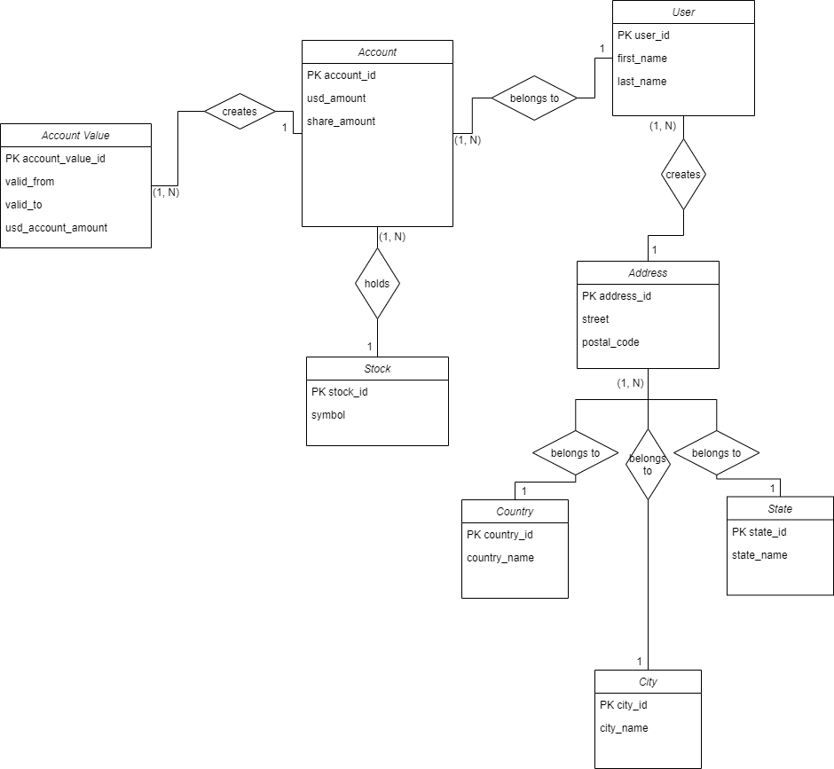

# Design
This stock simulator will allow users to simulate stock purchases based off the real stock market. 
Users will be able to set how many shares of a specific stock they wish to purchase and the price they wish to purchase those shares at.
Then users will have access to end of day stock market data which shows the actual value of their investment based off the real stock market prices.

  

## Features
### Database
- [x] Data model
- [] Create ETL jobs from data model

### Backend
Currently, the backend is programmed with Python

- [x] Implement database connection design
- [x] Create user dao
- [] Create account dao
- [] Purchase stock at today's real-time price
- [] Last updated date
- [] Next update countdown

### Frontent
- [] Frontend (TBD)
- [] Purchase stock at today's real-time price
- [] Last updated date
- [] Next update countdown